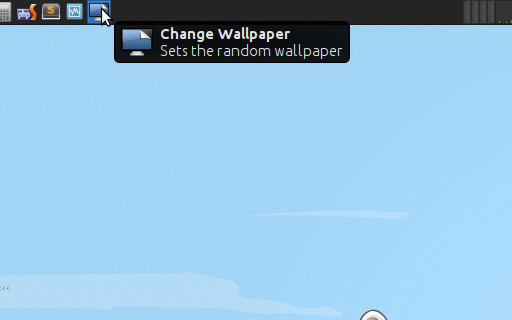

v-xfce-random-wallpaper
=======================

Sets the random wallpaper from a folder

Setup
-----
Change "dir" variable to your wallpapers directory

Cron
----
Read [CronHowto](https://help.ubuntu.com/community/CronHowto)

	$ crontab -e

For changing wallpaper every day at 13 o'clock:

	0 13 * * * DISPLAY=:0.0 ${HOME}/.local/bin/v-xfce-random-wallpaper.sh
